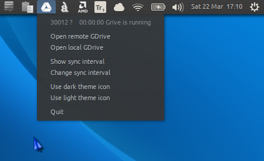

NOTICE
===============
This repository is a duplicate of https://github.com/Sadi58/grive-indicator for the purpose of adapting it for the new alternative to the obsolete **grive** client: https://github.com/odeke-em/drive

**Therefore this "work-in-progress" should not be used until this notice is removed.**

indicator-drive
===============

A very simple and lightweight indicator applet to synchronize with Google Drive using **drive**.

Here's a screenshot of its predecessor:

Installation
===============

1. Install **drive**, **python-appindicator**, **zenity** and **indicator_drive** (e.g. using the `install-drive` and then `install-indicator-drive` scripts below), AND

2. If using the **drive** client for the first time, have it authenticated by creating your local Google Drive directory (e.g. `~/Drive`) and then entering the terminal command `drive init ~/Drive` and following the instructions (i.e. click the url link, choose your Google account, copy and paste the code provided).

The indicator-drive should now be listed among startup applications and ready to start on next login.
