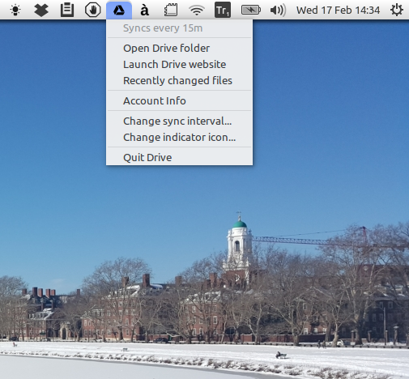

Suspension Notice (& Invitation for Adopters/Collaborators)
----------------------

**This work has been suspended in favor of what looks like a better alternative:**

**https://www.thefanclub.co.za/overgrive**

I personally think it's worth giving $4.99 for this valuable work :-)

Drive Indicator
===============

A very simple and lightweight indicator applet to synchronize with Google Drive using **drive** (https://github.com/odeke-em/drive).

Important Notice
----------------------

This indicator is based on https://github.com/Sadi58/grive-indicator that used the obsolete **grive** client. The new **drive** client is currently under active development but it's not designed as a **synchronization tool** (at least not yet). Therefore this indicator has the same limitations as the "backend" Drive client, and its use for synchronization purposes might have some unforeseen and/or undesirable effects. For it essentially uses two commands, `drive push` and `drive pull` with options `-no-prompt -ignore-name-clashes -ignore-conflict -ignore-checksum` which end up mirroring the local folder on the remote Drive (push) and vice versa (pull).

Also some Google API errors may from time to time cause false detection of (major) differences (sometimes leading to complete removal of the local Drive directory!) but a precautionary notification has been added to abort such false synchronizations.

Installation
----------------------

Install **drive**, **python-appindicator**, **zenity**, **inotifywait** and **indicator-drive** (e.g. running the `install-indicator-drive` script provided in a terminal window).

If using the **drive** client for the first time, installation should start with (1) creating your local Google Drive directory (e.g. `~/Drive`), (2) entering the terminal command `drive init ~/Drive` and (3) following the instructions (i.e. click the url link, choose your Google account, copy and paste the code provided) for its authentication/configuration.

Change Log
----------------------

- **0.92b:** Moved from "/usr/local/" to "/usr/share/" with some fixes and enhancements
- **0.91b:** Upgraded to version 0.91b with minor fixes
- **0.90b:** Moved from Alpha to Beta stage
